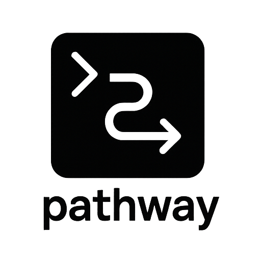

# Pathway

<div align="center">
  
  
  **🚀 Smart URL router for developers**
  
  *Launch URLs in the right browser with the right profile, every time*
</div>

<div align="center">
  
[](https://github.com/guria/pathway/actions/workflows/ci.yml)
[](https://github.com/guria/pathway/actions/workflows/quality.yml)


</div>

---

## ✨ Features

### 🎯 Smart Browser Selection
- Auto-detect available browsers on your system
- Support for Chrome, Firefox, Safari, and more
- Zero-config for basic usage
- Custom browser command support *(Coming Soon)*
- Smart URL routing with profiles *(Coming Soon)*

### 👤 Profile Management
- Named profiles (`--profile "Work"`)
- Temporary isolated profiles
- Custom user data directories
- Incognito and guest modes

### 🔒 Security & Reliability
- URL validation with scheme restrictions
- Path traversal protection
- Safe error handling and fallbacks

## 🚀 Quick Start

```bash
# Basic usage - system default browser
pathway launch https://example.com

# Specific browser
pathway launch --browser chrome https://github.com

# With profile
pathway launch --browser chrome --profile "Work" https://slack.com

# Incognito mode
pathway launch --browser chrome --incognito https://banking.example.com

# Multiple URLs
pathway launch --browser chrome https://github.com https://stackoverflow.com
```

## 📦 Installation

```bash
# Clone and build
git clone https://github.com/guria/pathway.git
cd pathway/core
cargo build --release

# Install system-wide
cargo install --path .
pathway --version
```

## 📖 Usage

<details>
<summary><strong>Browser Management</strong></summary>

```bash
# List available browsers
pathway browser list

# Check browser availability
pathway browser check chrome

# JSON output for scripting
pathway browser list --format json
```
</details>

<details>
<summary><strong>Profile & Window Options</strong></summary>

```bash
# Named profiles
pathway launch --browser chrome --profile "Development" https://localhost:3000

# Temporary profile
pathway launch --browser chrome --temp-profile https://example.com

# Custom user directory
pathway launch --browser firefox --user-dir ~/my-profile https://example.com

# Window options
pathway launch --browser chrome --new-window https://example.com
pathway launch --browser chrome --incognito https://example.com
pathway launch --browser chrome --kiosk https://dashboard.example.com
```
</details>

## 🔧 Configuration

### JSON Output
All commands support `--format json` for programmatic integration:

```json
{
  "action": "launch",
  "status": "success", 
  "urls": ["https://example.com/"],
  "browser": {
    "name": "chrome",
    "channel": "stable",
    "path": "/Applications/Google Chrome.app"
  },
  "profile": {
    "type": "named",
    "name": "Work"
  },
  "window_options": {
    "new_window": true,
    "incognito": false,
    "kiosk": false
  }
}
```

## 🛠️ Development

```bash
# Setup
git clone https://github.com/guria/pathway.git
cd pathway/core

# Build and test
cargo build --release
cargo test

# Code quality
cargo fmt
cargo clippy -- -D warnings
```

## 🤝 Contributing

Contributions welcome! For major changes, please open an issue first.

**Quick setup:**
1. Install Rust 1.82+
2. Fork and clone the repository  
3. Run `cargo test` to verify setup
4. Make changes, run `cargo fmt` and `cargo clippy`
5. Submit a pull request

## License

This project is licensed under either of

- Apache License, Version 2.0, ([LICENSE-APACHE](LICENSE-APACHE) or <http://www.apache.org/licenses/LICENSE-2.0>)
- MIT license ([LICENSE-MIT](LICENSE-MIT) or <http://opensource.org/licenses/MIT>)

at your option.

### Contribution

Unless you explicitly state otherwise, any contribution intentionally submitted
for inclusion in the work by you, as defined in the Apache-2.0 license, shall be
dual licensed as above, without any additional terms or conditions.

## 🙏 Acknowledgments

Built with [Rust](https://rustlang.org/) for performance and safety, developed in collaboration with various AI tools and agents including GitHub Copilot, Claude, and other modern development assistants.

---

<p align="center">
  <strong>⭐ Star this project if you find it useful!</strong>
</p>
